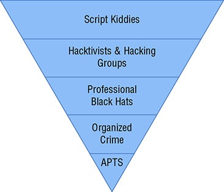

# 1.3 Explain the importance of scoping an engagement properly
## Types of assessment
The assessment type is important, as it will help clarify the primary objectives for the engagement.
### Goals-based/objectives-based
Goals-based or objectives-based assessments are conducted for specific
reasons. Examples include validation of a new security design, testing an
application or service infrastructure before it enters production, and
assessing the security of an organization that has recently been acquired.
### Compliance-based
Compliance-based assessments are designed around the compliance objectives of a law, standard, or other guidance and may require engaging a specific provider or assessor that is certified to perform the assessment.

A **PCI Data Security Standard** (PCI DSS) assessment is for organizations who accept, process, or store payment card information for consumers and  merchants, and was introduced to protect against credit card fraud.

**HIPAA** compliance regulates the protection of personal health information (PHI).

**FISMA** is a U.S. federal law passed in 2002 that requires federal agencies to  adopt and implement an information security protection program.

### Red team
Red-team assessments are typically more targeted than normal penetration tests. Red teams attempt to act like an attacker, targeting sensitive data or systems with the goal of acquiring data and access. Unlike other types ofpenetration tests, red-team assessments are not intended to provide details of all of the security flaws a target has. This means that red-team assessments are unlikely to provide as complete a view of flaws in the environment, but they can be very useful as a security exercise to train incident responders or to help validate security designs and practices.
## Special scoping considerations
### Premerger
Company mergers involve two or more companies that combine to create one legal entity. If you conduct a pentest against company A during a premerger, company B may have a vested interest in how the company’s assets and best interests are being protected, since weakness from company A could ultimately affect company B.
### Supply chain
A supply chain is the manufacturing, processing, and distribution of goods from company to consumer. A supply chain attack is a way of circumventing the weakest link in the supply chain in order to exploit the target organization. The supply chain may include other third parties outside of the target organization’s control. During the scoping process, ensure you know who all the players are going to be and define authorized boundaries for the pentest.
## Target selection
### Targets
#### Internal
##### On-Site vs off-site
#### External
#### First-party vs third-party hosted
#### Physical
#### Users
#### SSIDs
#### Applications
### Considerations
**Allow list vs deny list**
**Security exceptions**
White box assessments will provide direct access to the systems that are being
tested. Common security exceptions for white box tests are as follows:
- IPS/WAF allow list
Whitelisting testers in Intrusion Prevention Systems (IPSs), Web Application Firewalls (WAFs), and other security devices will allow them to perform their tests without being blocked.
- NAC
Security exceptions at the network layer, such as allowing testers to bypass network access controls (NACs) that would normally prevent unauthorized devices from connecting to the network.
- Certificate pinning
Bypassing or disabling certificate pinning.
Certificate pinning associates a host with an X.509 certificate (or a public key) and then uses that association to make a trust decision. That means that if the certificate changes, the remote system will no longer be recognized and the client shouldn’t be able to visit it. Pinning can cause issues, particularly if an organization uses data loss prevention (DLP) proxies that intercept traffic. Pinning can work with this if the interception proxy is also added to the pinning list, called a pinset.

**Company's policies**

Access to user accounts and privileged accounts can play a significant role in the success of a penetration test.

Physical access to a facility or system is one of the most powerful tools a penetration tester can have.

Network access, either on site, via a VPN, or through some other method, is also important, and testers need access to each network segment or protected zone that should be assessed.
## Strategy
### Unknown environment vs known environment vs partially known environment

## Risk acceptance
## Tolerance to impact
## Scheduling
## Scope creep
It is important to ensure that you have planned for this with the sponsor of the penetration test and know how you will handle it. They may opt to retain the original scope, engage you to perform further work, or request an estimate on the new scope.
## Adversary tiers

## Threat actors
A threat actor is an individual or group that is capable of manifesting a threat and is motivated and capable of exploiting the assets of an organization.
| Threat Actor | Intent | Capabilities | Target |
|--------------|--------|--------------|--------|
| APT (Advanced Persistent threat) | Steal sensitive or valuable information | Stealthy, continuous, and sophisticated hackers | High-profile individuals and organizations|
| Script kiddies | Self-motivated, likely for personal gain or profit | Less skilled hacker that uses public tools, exploits, and techniques | Less risk-averse organizations or individuals with little to no knowledge of security |
| Hacktivist | Politically or socially motivated | One or more individuals with various levels of expertise | High-profile individuals and organizations |
| Insider threat | Revenge, financial, problems. or espionage | Insider knowledge; could have privileged acccess to information systems | Individual's current or previous place of employment |

### Capabilities
### Intent

### Threat models